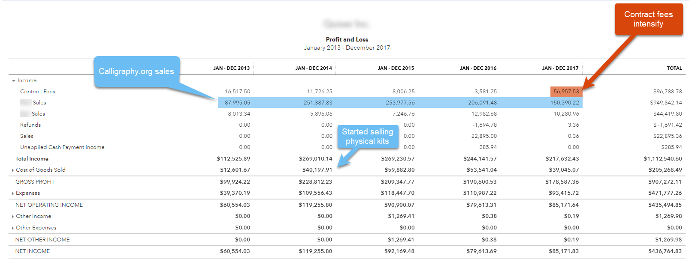
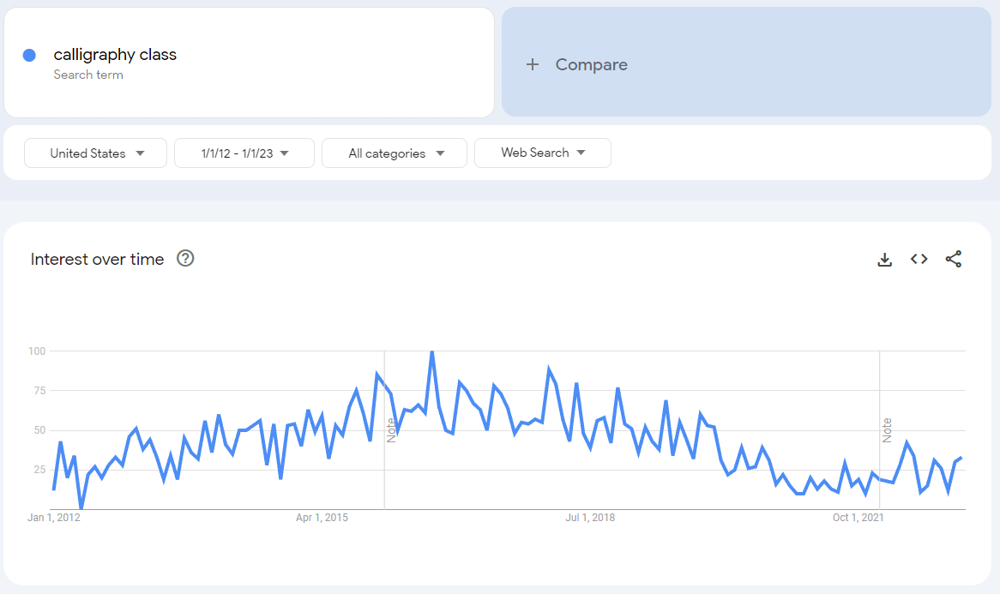

## Bootstrapping Experience

My wife and I bootstrapped [Calligraphy.org](https://www.calligraphy.org/) to >$250k/yr from 2012 to 2014 before it collapsed in 2017.

I was full-time on the project for 4 years.

Toward the end I started hustling contracting work to make up for flagging sales.

[Calligraphy.org](https://www.calligraphy.org/) fed our family and was our primary income for those 4 years.

## VC-backed Startup Experience

I joined [BoomPop.com](https://boompop.com/) in January 2021 and worked on the primary, client-facing product until April 2023. BoomPop is an [Atomic VC](https://atomic.vc/) company, so it was literally founded by a venture capital fund.

I was the only front-end dev when I started at BoomPop. We hired two more full-time front-end devs and a few full-stack devs to help out.

I recently jumped to [Highlight.io](https://www.highlight.io/), another VC-backed startup with a couple of years under its belt. We're building an open-source server and web monitoring platform. I'm working in more of a developer relations role this time, writing SDKs, small features on the primary product and a lot of documentation, blogs and public-facing content.

## When bootstrapping works, it's Heaven on Earth

I fell in love with bootstrapping.

I fell so hard I can't stop thinking about it.

When Calligraphy.org was running hot, I was on top of the world. We had a great growth curve. We were going to build a $500k+/yr business that we'd run until we retired.

I had full autonomy.

If I saw a problem with the business, I'd start work on it today... or tomorrow... or whenever made the most sense.

I handled the accounting, the wholesale ordering, customer order fulfillment and of course all of the web dev.

My wife is a phenomenal calligraphy teacher. Her social media profile brought plenty of clients to our site, where potential students enter their email, get signed up for an email drip, and eventually make a purchase on [store.calligraphy.org](https://store.calligraphy.org/)—a Shopify store that integrates with [Calligraphy.org](https://www.calligraphy.org/).

I worked 2-4 hours a day. I could go longer or shorter as needed. It wasn't particularly hard to keep up. In fact, most of my workday was spent trying to diversify the business and start something new. I spun up all sorts of projects during those years.

## Bootstrap failure hurts. A lot.

The business started to take a pretty hard turn for the worse at the end of 2017.

Our revenue had dropped from $250k to $150k that year, and that included $50k of consulting revenue that I'd ginned up to try to shore up our finances.

Ouch.

The business was dying.

We tried to kick into overdrive, but there was nothing actionable. We'd tried all of our best ideas already. The business was just failing. Slowly. We just watched it wither.

The slow decline was excruciating.

My wife had been hustling for years and her energy was fading. But the core driver was consumer behavior. A bunch of competitors had cropped up, and while their products were inferior, they were cutting into our revenue. And to top it off, the mid 2010's calligraphy trend that we'd ridden was breaking hard. We'd caught a wave of intense interest in calligraphy, driven by social media influencers like my wife who showed off their art on Instagram.

But the Instagram crowd was moving on. Search volume for "calligraphy class online" was dropping. We still ranked at or near the top of Google for all of the keywords we cared about, but traffic was dying out.

## When to quit your job

**DO NOT QUIT** prematurely.

Take your time. Work double time for a few months.

Nothing will kill your bootstrapping ambitions faster than running out of funds, and your wife and kids will get cranky fast.

Bootstrapping usually takes years to become profitable. Very few people have years of runways saved up, so a much better model is to work on the project while holding your job.

Working two jobs gets old fast, so be nice to yourself. Recognize that you're in it for the long haul. It could be a few years before you can go full-time.

And know when to quit. Don't chase a dream forever.

## Bootstrapping Pros

- Maximum independence
- Reasonably low revenue needs, because it all goes to you!
- No boss or timelines

## Bootstrapping Cons

- It's lonely
- You're forced to operate outside of your specialty
- You **must** be a triple-threat
  - Programming
  - Marketing
  - Product development

## VC-backed startups can be fun!

I got to work with a small team on [BoomPop.com](https://boompop.com).

We started out very small and focused. Of course, we were also a bit of a mess, because we didn't have much process.

The process developed slowly but gradually.

Eventually we were a company of 20+ people including 6 engineers. Our revenue was moving up-and-to-the-right, and we were building product that folks were using!

I spent my days swinging for the fences, and I mostly got to swing at strikes. I rarely had to venture out of my strike zone to chase a stray task.

## I was **not** in the driver's seat

We eventually had to make a hard pivot.

Our original product was no longer growing, and stagnation is death in VC-land. A smaller business could've focused on milking every last dollar from that market, but BoomPop is VC-backed, so we had to pivot to another business model with much larger potential.

We pivoted successfully, but it broke me.

We changed everything, including my favorite parts of my job.

I was a full-stack developer again, working on a React/Node/AWS stack. I love React and Node, but AWS is less thrilling to work with. I got everything running well enough. It wasn't a deal breaker by any means... but it was a constant source of annoyance to debug our AWS stack issues. And if you've worked with AWS, you know how complex any fully-AWS application becomes. The simplest Hello World app with a database and auth would require ten minutes to deploy.

Eventually I lost the will to go on.

Startups are a faith-based activity. You have to **believe**, and the moment you lost that belief, you're dead weight. I no longer looked forward to sitting down to work. I did it because I had a team to support and a sense of professional duty to the company.

## VC-backed Pros

- Stay specialized
- If you hire well, you can work with amazing people
- The sky is the limit

## VC-backed Cons

- A single iffy hire can ruin your company
- The investors own you, literally
- Anything short of a home run will not produce large wealth
- VCs routinely ruin good small businesses while trying to make them huge

# Equity

Equity deserves its own essay.

Nobody seems to understand equity, and I sometimes doubt myself, but I'll try to hit the high points.

## What percentage do you own?

Equity is measured in "basis points", or 1/1000 shares of the company. You must **insist** on always knowing how many shares are outstanding at your company. 

For instance, if you own 10 basis points—bps or "bips"—of a company, and it sell for $100MM, you can expect a $100k payout. The company would have to sell for $1B for you to make $1MM. Those are very big numbers, and its easy to forget that $100MM to $1B is a 10x growth in the business.

## Dilution matters

If you join early enough—pre-Series A—you may get a grant for 50bps, or 50/1000 of the company. So $100MM would net you $500k!

But wait! You joined early. The Series A round will likely dilute you 20%. And a Series B could easily diulte you another 20%. You're already down to 32bps. If you IPO after that Series B, you might actually make $320k for a $100MM valuation, or $3.2MM per $1B of valuation!

But that's actually a very optimistic set of assumptions. Dilution is often much, much higher. A bad Series A raise could easily dilute you 70%. Ask me how I know.

And the company doesn't have to tell you about any of this.

In fact, the worse the dilution, the less likely they are to volunteer the information.

So insist on knowing the share count at all times. Make it a condition of your continued employment.

They're hiding something dirty if they play coy about shares outstanding.

# Conclusion

Bootstrapping is awesome and I hope to try it again someday. But for now, I need to feed my family and draw a salary. I can only hope that my equity pays out someday.