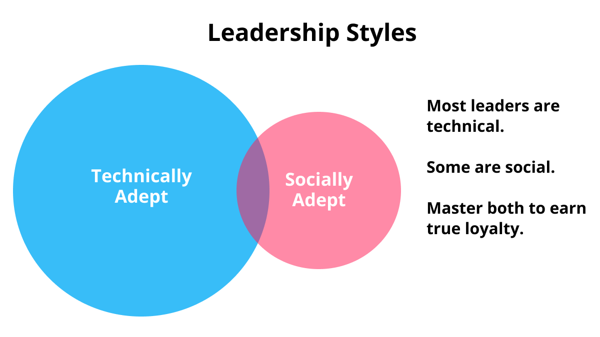

I posted a [Twitter thread](https://twitter.com/ChrisEsplin/status/1666899559740751873?s=20) the other day about my current approach to office politics. Let's expand.

## Technical vs Social Leadership

We tend to follow people because they're either technically proficient or socially proficient.

Maybe 80% of successful leaders are technical leaders. They've risen through the ranks on their technical abilities and we trust them to lead us to technical success. They're usually not socially adept and we tolerate their lack of social leadership.

The other 20% of leader are socially adept. People like being around these leaders and want to work for them because they trust them personally.

## The Unicorn Leader

There's a Venn diagram intersection of technical and social leaders. That's where I'd like to be. I've only met a few leaders who tick both of those boxes, and working for them is a transcendant experience. I trust them technically and personally. I'd follow them from company to company if I could.

## Working with non-Unicorns

Precious few of our leaders and coworkers are unicorns, so we must become the unicorns that we wish surrounded us. It's an impossibly high bar. I am nowhere near clearing it. 

While I am not a "Unicorn Leader" myself, I'm getting closer every year, and this is how I'm approaching it.

## Evaluate motivations

Every coworker and/or leader has a variety of motivations. Motivations can change minute to minute and year to year. People are dynamic.

### Common Motivations

1. Ego
1. Approval
1. Fear
1. Greed
1. Competition

#### Competition

I find competitive folks the easiest to work with. I personally love a competitive coworker, because competition can bring out the best in everyone. Work is rarely a zero-sum game, so competition usually raises everyone's performance. The dark side is when folks mistake work for a zero-sum game and undermine the group for their own benefit. The zero-sum-game mentality is incredibly destructive, so if you can't help these folks see the light... ouch. You've got no choice but to run far, far away.

#### Approval and Fear

Approval- and fear-motivated folks are easy to work with too. Be liberal with approval and reassure your fearful brethren with an optimistic outlook and you can easily win these folks over and create a positive outcome for all. I've been fear- and approval-motivated a lot in my life. All I needed to find my happy place was some reassurance from those above me in the hierarchy.

#### Greed

I've been greed-motivated for periods of time. It's not the best feeling, but it's very real. I needed money. I was behind on my financial goals and it made me susceptible to crazy ideas. All I needed to stick with a job was a good paycheck and financial growth potential. I'd take a miserable job if the money were good. 

#### Ego

The ego motivation tends to flare up and die down. Perpetually ego-driven folks can rise to the top of a hierarchy, but everyone hates them eventually. The more common issue is when we allow ego to drive interactions in the short term. This kind of ego is tolerable and corrosive. We all know the feeling of watching a family member or coworker fall prey to their ego and make inexplicably bad decisions. Your sister picks a fight and wants to argue about something asinine, or a coworker doing a PR review gets salty that you refactored their code.

Ego is purely destructive. We all fall prey to it. If you're dealing with someone else's ego, your best bet is to tread lightly and gently soothe it. They're likely feeling some level of insecurity and just need a hug... but what does that hug look like? In a PR review, it's an acknowledgement of the grievance. You're so, so sorry for refactoring their files. The code looked great and was a perfect match for the earlier state of the codebase, but things have changed and we need to decouple these modules... or whatever excuse you can come up with. The point is that our ego flares when we feel attacked. Ego chills out when we feel respected and acknowledged.

And when you feel your own ego flaring up... call it out. Call it out in your head and maybe even in front of everyone. A little self-deprecating humor can help you accept criticism. For example, if my code's getting refactored and I don't like it, I could crack a joke about how sad I am to see my "perfect" code get deleted. What a shame! But onward and upward... right???

## Inexplicable Decisions

Leaders and coworkers will sometimes make decisions that we just don't understand.

They'll give a reason, but it's disingenuous. They're not lying on purpose... but they're not being fully transparent either. For example, your team's getting downsized and it doesn't make sense. You have a ton of work and the company is making money hand-over-fist, so why shrink the team???

We have to understand what's going on for real. Or at least we can guess.

Start with empathy. What are the absolute best reasons to make this decision. Maybe the downsizing is more of a restructure, and there are even bigger opportunities that need smart, capable engineers to attack them. Maybe the team needs to refocus and the workload will get reallocated in time, but management has done a lousy job of communicating that.

Next, consider the worst possible case. In this example, management has no idea that you're under-resourced. They're out of touch and uncaring.

Now that we've bracketed the potential realities, how do we respond? The answer is usually better communication. We need to learn more. A lot more. And we need to communicate up the chain to help others understand our plight.

I once worked for a company that was making inexplicably bad technical decisions. The codebase was rotten, and everyone knew it... but the fixes would cost millions in engineering time. Leadership was always talking about big architectural changes. We were planning a big push... that never materialized. Some excuse would pop up and we'd continue on, business as usual.

I looked around the org for the perpetrator. Someone was behind this utter lack of action on the single biggest threat to our company.

One day the CTO suddenly resigned. They presented it as his decision, but I'm 100% certain that he was fired. As if by magic, all of the projects we'd been waiting to start got priority and we immediately made progress on fixing the company. It turns out the CTO was the source of our problems the entire time. 

My analysis is that the CTO was afraid of missing numbers and going over budget, so he was effectively sabotaging our efforts to allocate millions of dollars of engineering time to this effort that would see zero customer benefit in the short term. The CTO was non-technical and just couldn't understand the existential threat that a rotten codebase posed to ongoing development. Sales were still going strong. We were still finding ways to pump out features and bug fixes. How could the codebase be that bad???

## Don't fight human nature

We all have strong proclivities. And human nature has remained unchanged for millennia.

We're not going to overcome our worst habits and motivations without years of personal work. Instead, we should accept ourselves and those around us, just the way we are. Other people are part of the terrain. We're working on ourselves, even if today we happen to be ego-driven and miserable to work with.

Don't try to change others. Instead, harness their momentum and motivations to guide them in the right direction. And put yourself in situations that favor your strengths. This is easy to say in the abstract. The challenge is applying these principles to tough situations.
