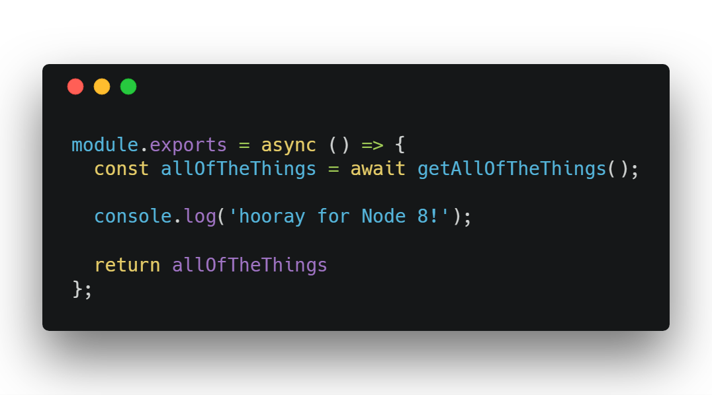

But Google Cloud’s Next conference is this week, and they [just announced the new Node 8 runtime](https://twitter.com/GCPcloud/status/1021829577826398208).

I miss my async/await from Node 8, so I spent the morning upgrading my Cloud Functions.

*async/await comes to Cloud Functions for Firebase*

## Steps to Upgrade to Node 8

Here’s what you need to do to get on the Node 8 train:

1. Upgrade your `firebase-functions` version to `2.0.0`

1. Upgrade `firebase-tools` to `4.0.0`

1. Add `"engines": { "node": "8" }` to your `/functions/package.json`

I had some difficulty figuring out these steps, so I manually deleted a Node 6 version of my function using the GCP console. That may have helped… but I have no way of testing that now.

## Why Node 8?

Node 8 has [async/await](https://developer.mozilla.org/en-US/docs/Web/JavaScript/Reference/Statements/async_function) and the [spread operator](https://developer.mozilla.org/en-US/docs/Web/JavaScript/Reference/Operators/Spread_syntax).

There’s probably more… but I don’t care. That’s all that I need right now.

Both of these features have been around on the front end for a while now. Developing in Node 6 has been sad.

Oh yeah… and you can use Node-8-only packages… for whatever that’s worth!

## Examples

Here’s the repo that I’m working on right now: [firebase-ssr-starter](https://github.com/deltaepsilon/firebase-ssr-starter/tree/master/functions)

And there’s a new Node 8 branch of the [firebase/functions-samples](https://github.com/firebase/functions-samples/tree/Node-8) repo.