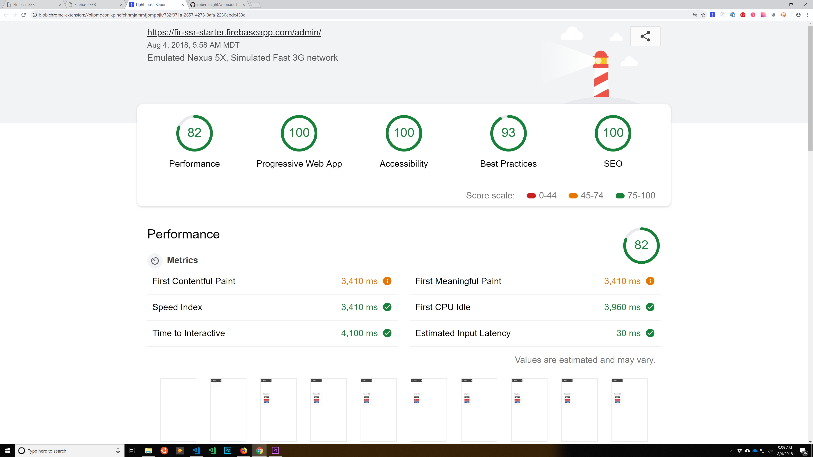
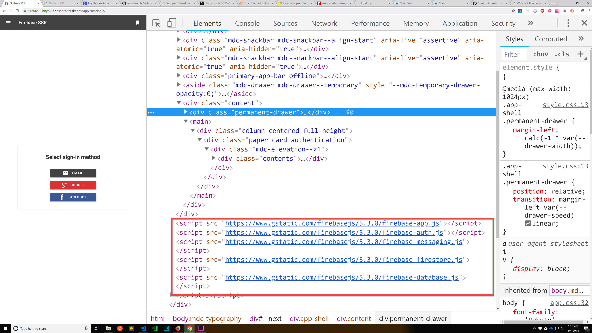

It’s so much fun to architect an app from scratch.

My latest project is another app starter, this time focusing on server-side rendered React with the regular hooks into Firebase and a special focus on performance.

It’s basically an app shell that scores well on Lighthouse and incorporates everything that I need. Once this app shell is running smoothly I’ll use it to start my next production app, so it’s super important that I get this done right, because my business will succeed or fail based on how well this app appeals to users.

I’m calling this initial project [Firebase SSR Starter](https://github.com/deltaepsilon/firebase-ssr-starter), where SSR stands for server-side rendered. And of course I have benchmarks to hit, which is why this is interesting!

1. The app needs to be SEO-friendly and server-side rendered.

2. I need an architecture that will last for three-to-five years.

3. I need to max out my Lighthouse performance score.

I’ve been doing a bunch of research and landed on [Next.js with React](https://nextjs.org/).

Next.js has an excellent server-side rendering system. Next is a framework…which I kinda hate… but it’s flexible enough, and it solves so many problems that I’d have to solve myself and I know that I couldn’t roll a stronger framework than Next.

Now for my maintainability requirement.

Three-to-five years is a steep requirement in the JavaScript ecosystem, so I’m not using any of the fancy, new stuff that I kinda want to use.

I need long-term maintainability, so I’m sticking with React.

I’d love to try [lit-html](https://github.com/polymer/lit-html) or use [Preact](https://preactjs.com/)… but I can’t justify it. React has the ecosystem momentum these days, and I’m going to need a lot of continuity. I need the lowest maintenance costs possible in years two through five of this app’s lifespan.

My last big, long-term app was written in AngularJS, and we all know how AngularJS went. Year one was great, two was a little sad, and years three and four have been a failure. The last time I had to build my old AngularJS app from scratch I spent 12 hours resurrecting it.

I’m not doing that again, so I’m sticking with tried-and-true React.

So what about performance?

[Lighthouse ](https://developers.google.com/web/tools/lighthouse/)is a Chrome extension that will be an integrated part of DevTools in Chrome 69. Lighthouse runs hundreds of tests on your app and tells you that your performance is horrible… so then you spend the next few days improving your app’s performance with Lighthouse’s checklist, and you either get to a perfect score of 100 or, like me, give up in the high 90s.

*Ugh. That first contentful paint is still slow.*

Lighthouse includes a bunch of nice-to-have optimizations.

A truly generic app architecture should be able to score a 100 on Lighthouse pretty easily; however, once you start to make app-specific decisions, scoring 100 can be impossible.

For instance, I’m using a [React Material Design framework ](https://jamesmfriedman.github.io/rmwc/)that doesn’t support passive scrolling.

And of course Lighthouse requires passive scrolling for a perfect one hundred, and I’m not about to hack into the internals of this Material Design framework, especially not for very minor passive-scroll improvements.

So I’m not scoring a perfect one hundred… but I got pretty close.

The hardest part of this entire Lighthouse performance audit was getting Firebase to load.

Each part of Firebase is available as its own SDK, so once the main firebase-app library is imported, you can import each piece separately.

But even in separate parts, Firebase is a heavy library.

All of those juicy Firebase features don’t come for free.

I optimized my Firebase imports by not bundling Firebase with the rest of my app. I added script tags for each part of the Firebase SDK into the app shell. But I made sure to put those script tags near the end of my body tag, because they have to be loaded in a synchronous, blocking manner.

*Loading Firebase SDK scripts at the end*

And I don’t want one hundred kilobytes of Firebase SDK to block my app shell’s initial paint time.

Putting the Firebase SDK scripts at the bottom of my app shell allows the rest of the shell to render before the SDK scripts block the page.

The tricky part of this process is that my app requires Firebase to boot so my app code needs to load just after the Firebase scripts are done loading.

This method has some benefits and one, big cost.

The cost is that my app will not be interactive until Firebase is fully loaded.

This hurts my time-to-interactive performance on the initial page load.

I really didn’t want to sacrifice my initial time-to-interactive, but it had to happen.

See, the benefits outweigh this cost, at least in my case, and that’s because I don’t want to suffer through the misery of making my app asynchronous.

It’s possible to only block the parts of the app that rely on Firebase, but that requires handling a bunch of asynchronous rending within the app itself.

And since Firebase is so core to the app’s architecture, there wouldn’t be much of the app that could load before the Firebase SDK. So the benefits of going all asynchronous with the Firebase loading aren’t huge and building the entire app around asynchronous Firebase loading would be quite challenging.

So I’m using Firebase’s CDN links for the SDK, which means that the client’s browser may already have the CDN files cached.

And since I have full Service Worker caching in place, only the very first page load is ever effected.

Once the client browser has the Firebase SDK files, the app will load almost instantly.

So it’s not perfect, but shipping code is all about making smart compromises. which means accepting that you can’t have all of the nice things at once.

*Trying to shrink that bundle size*

You can find my [Firebase SSR Starter code on GitHub](https://github.com/deltaepsilon/firebase-ssr-starter).

You’re welcome to copy it, but I’d recommend using it as a reference instead.

In my early years developing, I often used other people’s app starters for my projects.

It’s a great feeling to jump right into building my app-specific features, but building an app starter involves so many small decisions, and you need to make those decisions yourself to truly understand how the app works.

So I’ll probably reference this starter app a lot going forward, but I’ll most likely only use it for my next app because I’ll have learned so much by the end of that build out, that I’ll need to start fresh.

So copy/paste and learn from the past, but don’t value it too highly, because you always know more NOW than when you started your last app, and you need to be deeply familiar with your architecture if you hope to ship anything valuable.