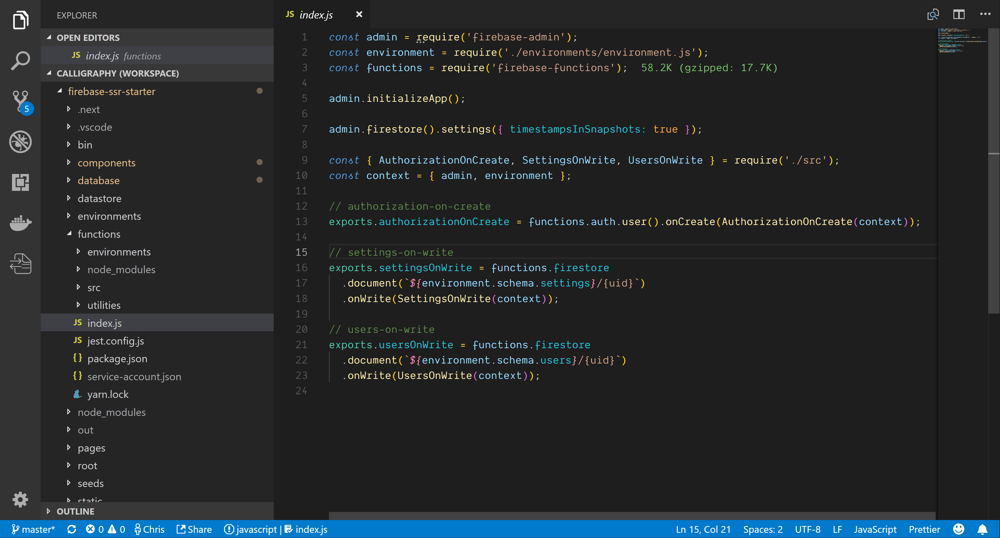
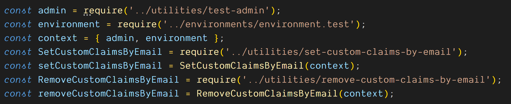
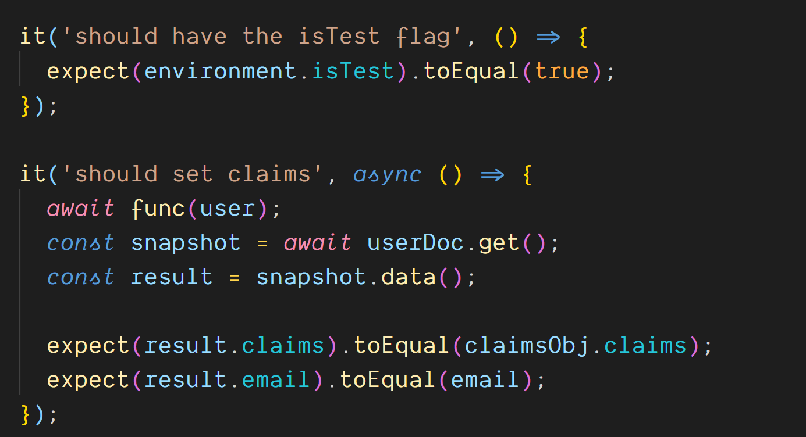

The Cloud Functions team has done a great job of creating local [Cloud Functions emulators](https://github.com/GoogleCloudPlatform/cloud-functions-emulator); however, I’m not a fan of local emulation.

Emulation is great if you don’t know how to write integration tests, but if you’re strong with testing, you’ll not only have a much nicer time with Cloud Functions, but you’ll also have much better job prospects.

Seriously folks.

Gain some experience with [test-driven development, ](https://en.wikipedia.org/wiki/Test-driven_development)and talk it up in your next interview. I’ve interviewed a lot of people, and I don’t find many candidates with great TDD experience.

And make sure to refer to it as TDD, short for test-driven development. The acronym helps your credibility a lot more than it should.

So let’s learn how to write Cloud Functions with test-driven development!

I use [Facebook’s Jest framework ](https://github.com/facebook/jest)for both front- and back-end testing.

Jest will test your browser JavaScript and your Cloud Functions Javascript with ease.

The best part of Jest is its excellent test runner. The Jest test runner lets us interactively run just the tests that we’re working on. I may have five big, nasty integration tests, and I only want to run one at a time and Jest makes that easy.

What we need to achieve is a red/green development cycle.

We write a failing test that imports our module and fails and we’re in a “red” or failed state. Then we write just enough code in the module under test to make the test pass and we’re in a “green” or passed state.

Now rinse and repeat, writing expectations in your tests and writing regular code, switching between “red” and “green” states, until the module is done.

Once the module you’re working on is all green, run all of your tests. When your tests are all passing, you’re good to commit your code to GitHub or wherever and maybe even release your code into a staging or production environment.

_Logs from the Cloud Functions runtime_

So let’s go over how this applies to Cloud Functions.

All Cloud Functions must be exported in a single **index.js** file.

When this **index.js** file is in the Cloud Functions runtime you’ll be able to call **admin.initializeApp()** without any arguments and Cloud Functions will automatically initialize your Firebase Admin SDK.

_/functions/index.js_

That doesn’t work in your test environment, so we need to work around that. We also want to test in a different Firebase environment than we use for production so we need to work around that too.

We’re going to use a concept called Dependency Injection to make this incredibly easy.

Basically, every Cloud Function that we write will be wrapped in a higher-order function.

“Higher-order function” is just a fancy way of saying a function that wraps another function, so make sure to drop that terminology in your next interview as well.

So we start with a higher-order wrapping function, which takes a context object as its one argument, and that context object has attributes named admin and environment.

The wrapping function now has both admin and environment in its scope and can close over…or wrap… the actual Cloud Function that we want to run.

This sort of Dependency Injection system enables us to test easily, because we can pass in our testing context when writing our tests and we can pass in our production context in our **index.js** file for Cloud Functions.

Our example here is a Cloud Function called **authorizationOnCreate**.

_/functions/src/authorization-on-create.js_

**authorizationOnCreate** is triggered by Firebase Authentication’s **onCreate** trigger, meaning that it will fire every time a Firebase Authentication user is created and it will receive the user’s JWT as its argument.

So let’s ignore the application-specific code here that’s doing the claim management, because it looks super complicated, even if its not and we don’t really care about it.

Now that we’ve seen how to use Dependency Injection with Cloud Functions, let’s look at our **index.js **file to see how we inject dependencies for production use.

Notice that we’re just passing our context object into **AuthorizationOnCreate**.

_Using dependency injection to pass in the Admin and Environment objects_

**AuthorizationOnCreate** will return its wrapped function as the **onCreate** callback so you can see how easy this is to use in the Cloud Functions runtime.

Now let’s see how to use it in our testing framework.

Jest automatically looks for files ending in **\*spec.js,** so we named our test file **authorization-on-create.spec.js**.

The spec file is where this system gets tricky, but I promise, promise, promise that it’s worth it to learn how to write these tests!

You’ll notice that our very first line calls jest.mock and passes in a module path. That’s because we don’t want to actually make calls out to Firebase Authentication.

The actual act of setting our custom claim would not work without a real life user, and we don’t want to try to simulate that in our test, so we’ve wrapped that action in a simple utility function called **setCustomClaims**.

_set-custom-claims.js_

**setCustomClaims** literally wraps a call to **auth.setCustomUserClaims()**, which would be pointless, except that it lets us mock it easily with Jest.

_mocked set-custom-claims.js_

Mocking means replacing real code with a fake function that does nothing.

So now that our custom claims call is replaced with a mock we can write the rest of our test.

I’ve written a test-admin utility to authenticate a new Firebase Admin SDK instance. I write a lot of tests, and I hate having to instantiate the Firebase Admin SDK every single time.

Next we’ll import our test environment from **environments/environment.test**.**js**

_environment.test.js_

This is a not-very-sophisticated way of managing test and production environments. We’ll literally just maintain one environment file for each environment that we need.

If we check out **environment.test.js**, we’ll see that it imports the prod environment, and then overwrites some attributes so that our tests don’t overwrite real data.

In this case we’re going to be saving our users to test-users and our custom claims to test-custom-claims.

Our production environment doesn’t have the test- prefixes, so our tests will never collide with development or production data.

And if our tests fail to clean up after themselves, it’ll be easy to spot the issue.

…and now back to the spec file…

You’ll see that we’ll add the admin and environment variables to a context object. Then we’ll initialize two utility functions just for the purposes of this test.

_Initializing with a context object_

See, testing is tricky, and you need to do some set up and tear down. In this case we need to set some custom claims data to the Realtime Database, and when we’re done we’ll need to delete it.

That’s one of the principles of writing integration tests like this one. You need to seed data into the database, perform your operations, and then clean it up. You don’t want to leave any old data lying around, because it could interfere with other tests.

So we have two utility functions, **setCustomClaimsByEmail** and **removeCustomClaimsByEmail**. We’ll pass the context object into both so they can set and remove our data.

Don’t worry about the details of how these functions are working, because they’re literally just setting and removing data from the Realtime Database.

We have more set up to do, so stay strong and let’s forge ahead!

Next we’ll import the actual function that we want to test.

I like to name my functions generically in my spec files, because I’ll start my next Cloud Function by copying and pasting this spec file, and I like to limit how much I need to rename when copying and pasting for new tests…so I’ve named this function **Func** with a capital F.

Now we’ll initialize our Firestore database and our Firestore settings.

And we’ll need access to our **usersCollection** later, so we’ll initialize it here too.

_Initializing the function and other goodies_

Now for our first describe block.

Every Jest test should be nested within one or more describe blocks. You can nest describe blocks as much as you like. Jest provides **describe** as a global function that you can use within any Jest spec file.

It also provides **beforeEach**, **afterEach**, **beforeAll** and **afterAll** as global functions.

_Initialize and tear down the tests in before_ and after* functions*

You can call these before and after functions within any **describe** block in order to run some code before and after each **“it”** block, or before and after all of the code in the describe block.

**“it”** is another global function from Jest that lets us write our actual tests.

So we’re going to do a bunch of setup in our **beforeEach** function and a little cleanup in our **afterAll**.

Before each test we’re going to initialize our capital “F” **Func** function and assign it to a lowercase “f” **func** variable. We’ll initialize it with the testing context that we defined earlier.

Now we’ll create a fake user JWT, a reference to our userDoc and a fake claims object.

Our beforeEach function is async, so we’ll return our **setCustomUserClaims** functions which returns a promise and will set our claims object to the Realtime Database.

After all of our tests are done we’ll asynchronously delete our user doc and remove our custom claims object with **removeCustomClaimsByEmail**.

So now we have the code to populate our database and clean it up when we’re done and it’s time for our test!

This is going to be a little disappointing.

See, we just need to define an **“it” **block and give it a name and a function.

The first test is simply to make sure that we got the right environment object. I was fussing around with my environments, and this smoke test makes sure that my setup succeeded.

_The tests themselves become super-duper simple_

The second test has an async function, so we can await the call to **func** with the user argument.

Now that our function has run, we’ll await a call to **userDoc.get() **to get our user snapshot. This function is meant to take custom claims data from the Realtime Database and write it to a user object in Firestore.

So we’ll test that the user object in Firestore exists and has the right email address.

We could test this more extensively, but it’s not really necessary. If the doc got written and the email is there, we can trust that it’s working. If we have bugs later we’ll write test cases for those bugs individually, but it’s best not to overdo the testing.

You can waste an awful amount of time testing, so we’ll keep this minimal.

Once our tests are passing and everything is green, we’re good to ship this code to Cloud Functions. We could spend hours on the details of test-driven development, and I could easily give an hours-long workshop on how to do this efficiently… which I’ve done!

It’s all available on [FullStackFirebase.com](https://www.fullstackfirebase.com/).

_FullStackFirebase.com: Free and open-source_

The online written material is all free and the entire course is open-source.

You’ll need to pay a few bucks for the full Udemy course, but it’s the culmination of hundreds of hours of work on my part and it’s the quickest, cheapest way to learn Firebase on your own time.

_The Udemy course is plenty cheap :)_
